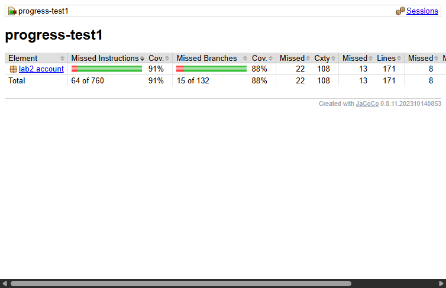
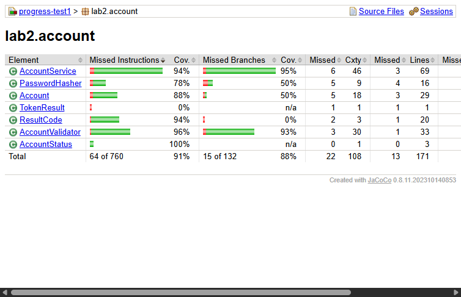

# SWT301 - ProgressTest 1: Unit Testing với JUnit 5

**Học viên:** Cao Đức Tiến  
**Mã số sinh viên (MSSV):** DE190608  
**Môn học:** SWT301 - Software Testing  
**Chủ đề:** Unit Testing module Account Management bằng JUnit 5 và JaCoCo  

---

## 1. Hướng dẫn chạy kiểm thử

Chạy toàn bộ test suite và sinh báo cáo JaCoCo coverage:
```bash
mvn clean test jacoco:report
```
Báo cáo coverage HTML được sinh tại:
`target/site/jacoco/index.html`

---

## 2. Thống kê bộ kiểm thử (Test Metrics)

| Chỉ tiêu | Yêu cầu tối thiểu đề bài | Kết quả đạt được | Đánh giá |
|---|---|---|---|
| **Số phương thức test** | >= 20 | **27 phương thức** | Vượt chỉ tiêu |
| **Số `@ParameterizedTest`** | >= 12 | **19 `@ParameterizedTest`** | Vượt chỉ tiêu |
| **Tổng lượt chạy (invocations)** | >= 60 | **136 lượt chạy** (0 failures, 0 errors, 0 skipped) | Vượt hơn 220% |
| **Nguồn dữ liệu tham số** | Đủ 4 loại (@ValueSource, @NullAndEmptySource, @CsvSource, @MethodSource) | Đầy đủ cả 4 loại | Đạt chuẩn |
| **JaCoCo Coverage** | Line >= 80%, Branch >= 70% | • **Tổng thể:** Line **91%**, Branch **88%**<br>• `AccountValidator`: Line **96%**, Branch **93%**<br>• `AccountService`: Line **94%**, Branch **95%** | Đạt chuẩn xuất sắc |
| **Lỗi giả lập (Mutation Testing)** | >= 3 lỗi | **3 lỗi giả lập đã chứng minh bị Kill** | Đạt chuẩn |

---

## 3. Ảnh chụp báo cáo JaCoCo Coverage

### 3.1 Tổng quan độ phủ dự án (Package Overview)


### 3.2 Độ phủ chi tiết từng lớp trong `lab2.account`


---

## 4. Bảng kết quả Mutation Testing thủ công (3 lỗi giả lập)

| # | Vị trí sửa trong Code Production (Cố tình tạo lỗi) | Test Case phát hiện và bắt lỗi (Killed By) | Kết quả kiểm thử | Trạng thái Mutant |
|---|---|---|---|---|
| **M1** | Trong `AccountService.login()`: Đổi điều kiện khóa từ `>= MAX_FAILED_ATTEMPTS` thành `> MAX_FAILED_ATTEMPTS` | `Login.login_WrongPassword5thTime_LocksAccount` | **FAILED** (Mong đợi `ACCOUNT_LOCKED` nhưng nhận `INVALID_CREDENTIALS`) | **KILLED** |
| **M2** | Trong `AccountService.login()`: Bỏ qua dòng `acc.resetFailedAttempts();` khi đăng nhập thành công | `Login.login_CorrectCredentials_ReturnsSuccessAndResetsCounter` | **FAILED** (Bộ đếm không về 0 sau khi đăng nhập thành công) | **KILLED** |
| **M3** | Trong `AccountValidator.isValidUsername()`: Đổi regex `{4,19}` thành `{4,20}` | `Username.isValidUsername_BoundaryLength` (biên độ dài 21 ký tự) | **FAILED** (Mong đợi `false` nhưng trả về `true`) | **KILLED** |

> *Ghi chú: Cả 3 lỗi giả lập đều đã được hoàn tác về mã nguồn chuẩn, toàn bộ test suite đang chạy 100% xanh.*

---

## 5. Ma trận truy vết yêu cầu (Traceability Matrix)

| Mã nghiệp vụ (BR) | Phương thức kiểm thử tương ứng |
|---|---|
| **BR-REG-01** (Input rỗng/null, ngày tương lai) | `Register.register_NullEmptyBlankUsername`, `register_NullEmptyBlankEmail`, `register_NullEmptyBlankPassword`, `register_AgeBoundary_RelativeDates` |
| **BR-REG-02** (Quy tắc Username) | `AccountValidatorTest.Username.*`, `Register.register_InvalidInputs_ReturnsExpectedCode` |
| **BR-REG-03** (Trùng Username không phân biệt hoa thường) | `Register.register_DuplicateUsername_CaseInsensitive` |
| **BR-REG-04** (Quy tắc Email) | `AccountValidatorTest.Email.*`, `Register.register_InvalidInputs_ReturnsExpectedCode` |
| **BR-REG-05** (Trùng Email không phân biệt hoa thường) | `Register.register_DuplicateEmail_CaseInsensitive` |
| **BR-REG-06** (Mật khẩu đủ 4 nhóm, không chứa username) | `AccountValidatorTest.Password.*`, `Register.register_InvalidInputs_ReturnsExpectedCode` |
| **BR-REG-07** (Xác nhận mật khẩu trùng khớp) | `Register.register_InvalidInputs_ReturnsExpectedCode` |
| **BR-REG-08** (Đủ 18 tuổi, ngày tương đối) | `AccountValidatorTest.calculateAge_Boundaries`, `Register.register_AgeBoundary_RelativeDates` |
| **BR-REG-09** (Định dạng điện thoại) | `AccountValidatorTest.Phone.*`, `Register.register_InvalidInputs_ReturnsExpectedCode` |
| **BR-REG-10** (Đăng ký thành công, hash mật khẩu) | `Register.register_Success_CreatesActiveAccountWithCorrectState` |
| **BR-LOG-01..06** (Decision Table đăng nhập 6 quy tắc) | `Login.login_CorrectCredentials_ReturnsSuccessAndResetsCounter`, `login_NonExistentUser_ReturnsInvalidCredentials`, `login_DisabledAccount_ReturnsAccountDisabled`, `login_WrongPasswordUnderThreshold_IncrementsCounter`, `login_WrongPassword5thTime_LocksAccount`, `login_LockedAccount_DoesNotIncrementCounter` |
| **Admin Operations** (Khóa/mở khóa) | `Admin.unlockAccount_Success_ResetsCounterAndAllowsLogin`, `Admin.disableAccount_InvalidUser_ReturnsUserNotFound`, `Admin.isLocked_NonExistentOrNull_ReturnsFalse` |

---

## 6. Checklist tổng (Tự đánh giá trước khi nộp bài)

### A. Mã production
- [x] **A1** `mvn clean compile` thành công
- [x] **A2** `AccountValidator` đủ 5 hàm, null trả `false`, không ném exception
- [x] **A3** Mật khẩu băm SHA-256 + salt riêng, không lưu bản rõ
- [x] **A4** `register()` đủ BR-REG-01..10, **đúng thứ tự**
- [x] **A5** `login()`: sai 5 lần thì khóa; đang khóa không tăng bộ đếm; thành công thì đặt bộ đếm về 0
- [x] **A6** `unlockAccount()` mở khóa và đặt `failedAttempts = 0`
- [x] **A7** Username/email không phân biệt hoa/thường (`toLowerCase(Locale.ROOT)`), mật khẩu phân biệt
- [x] **A8** Không dùng `Clock`; không `System.out`, không biến static giữ trạng thái

### B. Mã test
- [x] **B1** $\ge$ 20 phương thức test, $\ge$ 12 `@ParameterizedTest`, $\ge$ 60 lượt chạy (Thực tế: 27 methods, 19 parameterized, 136 invocations)
- [x] **B2** Dùng đủ `@ValueSource`, `@NullAndEmptySource`, `@CsvSource`, `@MethodSource`
- [x] **B3** Biên: username 4/5/20/21, mật khẩu 7/8/32/33, email 100/101, tuổi 17/18 (qua `calculateAge`)
- [x] **B4** Biên số lần đăng nhập sai 4/5 và test mở khóa
- [x] **B5** $\ge$ 3 test thứ tự ưu tiên trong `register()`
- [x] **B6** `@Nested` + `@BeforeEach` tạo service mới cho mỗi test
- [x] **B7** Assert cả trạng thái, không `assertTrue(true)`, không `Thread.sleep`
- [x] **B8** Tên test theo mẫu `method_TinhHuong_KetQua`, AAA

### C. Chất lượng và nộp bài
- [x] **C1** `mvn clean test`: 0 failures / errors / skipped (136/136 test xanh)
- [x] **C2** JaCoCo Line $\ge$ 80%, Branch $\ge$ 70% (kèm ảnh chụp báo cáo đầy đủ)
- [x] **C3** $\ge$ 3 lỗi giả lập có ghi lại (M1, M2, M3 đã ghi lại và bị kill)
- [x] **C4** Lịch sử git $\ge$ 6 commit đúng Conventional Commits
- [x] **C5** File zip đúng tên `Lab2_<MSSV>_<HoTen>.zip`, không có `target/`, `.idea/`, `.vscode/`

---

## 7. Lịch sử commit tuân thủ Conventional Commits

- `chore(progressTest1): init maven project with junit5, jacoco and provided classes`
- `feat(validator): implement username, email, password, phone and age rules`
- `test(validator): add parameterized EP and BVA tests for AccountValidator`
- `feat(account): add Account entity and SHA-256 salted PasswordHasher`
- `feat(register): implement BR-REG-01..10 with required validation order`
- `test(register): cover BR-REG rules, priority order and age boundary`
- `feat(login): implement BR-LOG rules with lock after 5 failed attempts`
- `test(login): cover decision table, 4/5 failed-attempt boundary and admin unlock`
- `test(coverage): verify jacoco coverage and 3 manual mutants`
- `docs: add README with run guide, coverage, traceability and checklist`
